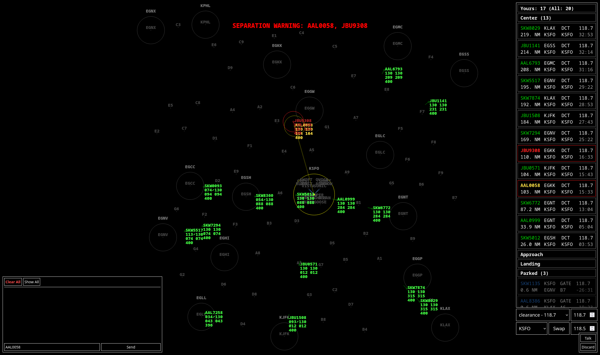

# Airwave

Airwave is a gamified airport simulator with airport management and realistic air traffic control (ATC) powered by your voice.

## Status

Airwave is under active development. However, the simulation system has been finalized, so if you're into a raw simulation, be our guest!

Here's how you can try it out: [Installation](./docs/src/getting-started/installation.md).

## Contribution and Community

We're always excited to welcome new contributors! Here's how you can help:

- **Report Bugs or Suggest Features:** Open an [issue](https://github.com/Vandesm14/airwave/issues).
- **Join the Discussion:** Contact us on [Bluesky](https://bsky.app/profile/airwavegame.bsky.social).
- **Lend Your Expertise:** If you're an aviation or ATC enthusiast, we'd love your insights to make Airwave more realistic.

## License

Airwave is licensed under the [GNU AGPLv3 license](./LICENSE).

Copyright (C) 2024 the Airwave contributors
